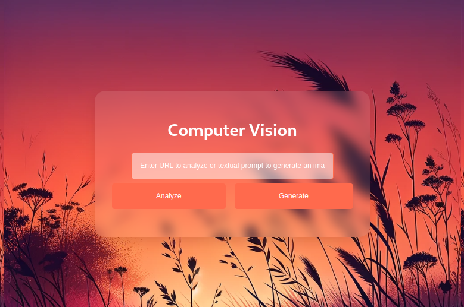
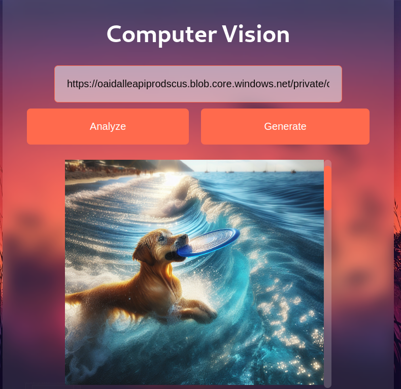

# Análisis de Imagen Web - Documentación

Bienvenido al repositorio del proyecto de análisis de imagen web. A continuación, se presentan capturas de pantalla que ilustran el funcionamiento de la aplicación.

## Capturas de Pantalla

### 0. Vista de la Web de Análisis de Imagen

### 1. Indexación de la Imagen en el DOM

### 2. Respuesta JSON de la API de Azure

## Uso

Para analizar una imagen:
1. Coloca la URL de la imagen en el campo correspondiente.
2. Presiona el botón 'Analizar'.

Para generar una imagen a partir de texto:
1 Escribe un mensaje de texto que describa lo que estás buscando generar.
2. Presiona el botón 'Generar'.

### 3. Respuesta URL de la API de Azure

Por favor, asegúrate de que la URL de la imagen sea accesible públicamente y que el mensaje de texto no exceda los 300 caracteres.

## Contribuciones

Este proyecto es parte del 'Challenge Azure 2023', donde se exploran y se implementan servicios cognitivos de Azure para el análisis y generación de contenido a partir de imágenes.

Para más detalles sobre el challenge, visita [Challenge Azure 2023](https://learn.microsoft.com/en-us/training/modules/challenge-project-add-image-analysis-generation-to-app/).

